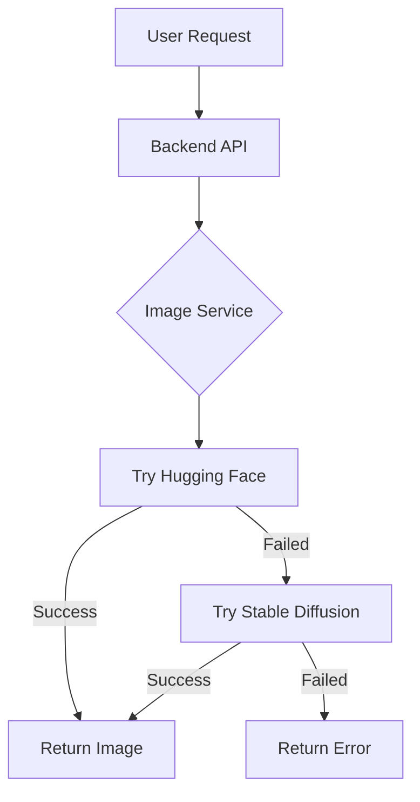

# 🎉 Image Generation Fallback System - COMPLETE!

## ✅ What's Been Done

I've successfully integrated **dual-provider image generation** into your AI project with automatic fallback between Hugging Face API and your local Stable Diffusion installation.

---

## 📁 Files Created/Modified

### **New Files:**

1. **[services/imageService.js](./services/imageService.js)** - Core image generation service
   - Handles both HF and SD APIs
   - Automatic fallback logic
   - Error handling and diagnostics
   - Health checks for SD API

2. **[IMAGE-GENERATION-FALLBACK-SETUP.md](./IMAGE-GENERATION-FALLBACK-SETUP.md)** - Complete documentation
   - Architecture overview
   - Configuration guide
   - Usage examples
   - Troubleshooting

3. **[QUICK-START-IMAGE-FALLBACK.md](./QUICK-START-IMAGE-FALLBACK.md)** - Quick reference
   - 3-step setup
   - Test instructions
   - Configuration presets
   - Common issues

4. **[test-image-generation.js](./test-image-generation.js)** - Test script
   - Tests both providers
   - Shows service status
   - Saves test images

### **Modified Files:**

1. **[routes/ai.js](./routes/ai.js)** - Updated image generation endpoint
   - Now uses imageService
   - Supports advanced parameters
   - Returns provider info

2. **[.env.example](./.env.example)** - Added configuration
   - HF API keys
   - SD configuration
   - Model settings

---

## 🔧 How It Works



### **Priority Order:**
1. **Primary**: Hugging Face API (FLUX.1-schnell) - Cloud-based, reliable
2. **Fallback**: Stable Diffusion Local API - Your local installation

### **When Fallback Triggers:**
- HF API rate limit exceeded
- HF API timeout/network error
- HF API key invalid
- HF service down

---

## ⚙️ Configuration Required

### Step 1: Update `.env`

```env
# Add these lines to your .env file:
HUGGINGFACE_API_KEY=hf_your_actual_key_here
SD_ENABLED=true
SD_API_URL=http://127.0.0.1:7860
```

### Step 2: Verify SD API is Enabled

Your `webui-user.bat` already has `--api` flag configured. ✅

Location:
```
C:\Users\sahid\OneDrive\PROJECTS\Practice\stable-diffusion-webui-master\stable-diffusion-webui-master\webui-user.bat
```

---

## 🚀 Testing Instructions

### Test 1: Run Backend Test Script

```powershell
cd C:\Users\sahid\OneDrive\PROJECTS\Practice
node test-image-generation.js
```

**Expected Output:**
```
🧪 Testing Image Generation Service

📊 Service Status:
{
  "huggingface": {
    "available": true,
    "model": "black-forest-labs/FLUX.1-schnell"
  },
  "stableDiffusion": {
    "enabled": true,
    "url": "http://127.0.0.1:7860"
  }
}

🎨 Generating test image...
✅ Hugging Face image generated successfully in 4523ms
💾 Image saved: uploads/images/user-test-user-123/test-image.png
```

### Test 2: Test from Frontend

Your existing frontend code will work without changes:

```javascript
// Existing code still works!
fetch('/api/ai/generate-image', {
    method: 'POST',
    headers: {
        'Content-Type': 'application/json',
        'Authorization': 'Bearer YOUR_TOKEN'
    },
    body: JSON.stringify({
        prompt: 'a beautiful landscape'
    })
})
.then(r => r.json())
.then(data => {
    console.log('Provider used:', data.provider); // NEW!
    console.log('Model:', data.model);            // NEW!
    console.log('Time:', data.processingTime);    // NEW!
    
    // Display image
    document.getElementById('output').src = data.imageUrl;
});
```

---

## 📊 Response Format (Enhanced)

Your API now returns additional metadata:

```json
{
  "success": true,
  "imageUrl": "/uploads/images/user-507f.../1702000000000-generated.png",
  "filename": "1702000000000-generated.png",
  "prompt": "a beautiful landscape",
  "userId": "507f1f77bcf86cd799439011",
  
  // NEW FIELDS:
  "provider": "huggingface",           // or "stable-diffusion"
  "model": "FLUX.1-schnell",
  "processingTime": 4523               // milliseconds
}
```

---

## 🎯 Usage Scenarios

### Scenario 1: HF Works (Normal)
```
Request → HF API ✅ → Returns image in ~5s
Provider: "huggingface"
```

### Scenario 2: HF Rate Limited → SD Fallback
```
Request → HF API ❌ (rate limit) → SD API ✅ → Returns image in ~10s
Provider: "stable-diffusion"
```

### Scenario 3: Both Fail
```
Request → HF API ❌ → SD API ❌ → Error with troubleshooting tips
```

---

## 🔍 Monitoring

Check your backend logs to see which provider is used:

**When HF works:**
```
🎨 Attempting image generation with Hugging Face...
✅ Hugging Face image generated successfully in 4523ms
```

**When SD fallback is used:**
```
🎨 Attempting image generation with Hugging Face...
❌ Hugging Face image generation failed: Rate limit exceeded
🔄 Falling back to Stable Diffusion local API...
📤 Sending request to Stable Diffusion API...
✅ Stable Diffusion image generated successfully in 8234ms
```

---

## 💡 Advanced Features

### Custom Parameters (SD Only)

```javascript
fetch('/api/ai/generate-image', {
    method: 'POST',
    headers: {
        'Content-Type': 'application/json',
        'Authorization': 'Bearer YOUR_TOKEN'
    },
    body: JSON.stringify({
        prompt: 'a cyberpunk city at night',
        
        // Advanced SD parameters:
        width: 768,
        height: 768,
        steps: 30,
        negativePrompt: 'blurry, low quality, distorted, ugly',
        cfgScale: 7.5,
        sampler: 'DPM++ 2M Karras'
    })
});
```

### Check Service Status Endpoint

Add this to your `routes/ai.js`:

```javascript
router.get('/image-status', (req, res) => {
    const imageService = require('../services/imageService');
    res.json(imageService.getStatus());
});
```

Test it:
```
GET http://localhost:3000/api/ai/image-status
```

---

## 🆘 Troubleshooting Guide

### Issue: "Image generation failed with all providers"

**Check HF API:**
```powershell
# Verify your .env has the key
cat .env | Select-String "HUGGINGFACE"

# Should output:
# HUGGINGFACE_API_KEY=hf_...
```

**Check SD API:**
```powershell
# 1. Is SD running?
Start-Process "http://127.0.0.1:7860"

# 2. Test API endpoint
Invoke-WebRequest http://127.0.0.1:7860/sdapi/v1/sd-models
```

### Issue: "Stable Diffusion API is not accessible"

**Solution:**
```powershell
# Navigate to SD folder
cd C:\Users\sahid\OneDrive\PROJECTS\Practice\stable-diffusion-webui-master\stable-diffusion-webui-master

# Verify --api flag
Get-Content webui-user.bat | Select-String "api"

# Start SD
.\webui-user.bat
```

### Issue: Images are slow

**For HF:** Nothing you can do (cloud API)

**For SD:** Reduce parameters
```javascript
{
    steps: 15,    // Instead of 30-50
    width: 512,   // Instead of 1024
    height: 512
}
```

---

## 🎨 Configuration Presets

### Preset 1: Production (Reliable)
```env
HUGGINGFACE_API_KEY=hf_...
SD_ENABLED=true
SD_API_URL=http://127.0.0.1:7860
```
✅ Best for production - HF primary, SD fallback

### Preset 2: Development (Unlimited Free)
```env
# HUGGINGFACE_API_KEY=   (commented out)
SD_ENABLED=true
SD_API_URL=http://127.0.0.1:7860
```
✅ Best for development - Free unlimited local generation

### Preset 3: Cloud Only (No Local Server)
```env
HUGGINGFACE_API_KEY=hf_...
SD_ENABLED=false
```
✅ Best when you can't run SD locally

---

## 📚 Documentation Files

1. **[IMAGE-GENERATION-FALLBACK-SETUP.md](./IMAGE-GENERATION-FALLBACK-SETUP.md)**
   - Complete setup guide
   - Architecture details
   - Configuration options
   - Troubleshooting

2. **[QUICK-START-IMAGE-FALLBACK.md](./QUICK-START-IMAGE-FALLBACK.md)**
   - Quick reference
   - 3-step setup
   - Common issues

3. **This file (IMPLEMENTATION-COMPLETE-IMAGE-FALLBACK.md)**
   - What's been done
   - Testing instructions
   - Usage guide

---

## ✅ Ready to Use!

Your AI project now has:
- ✅ Dual-provider image generation
- ✅ Automatic fallback system
- ✅ Detailed logging and monitoring
- ✅ Advanced parameter support
- ✅ Comprehensive documentation
- ✅ Test scripts

### Next Steps:

1. Add your HF API key to `.env`
2. Start Stable Diffusion: `.\webui-user.bat`
3. Start your backend: `node server.js`
4. Run test: `node test-image-generation.js`
5. Test from your frontend

---

## 🎉 Benefits

- **Reliability**: If one provider fails, automatic fallback
- **Cost Savings**: Use free local SD when possible
- **Flexibility**: Choose which provider to use
- **Transparency**: Know which provider was used for each image
- **Performance**: Track generation times

---

## 📝 Questions?

Check the documentation files or examine:
- [services/imageService.js](./services/imageService.js) - Core implementation
- [routes/ai.js](./routes/ai.js) - API endpoint
- [test-image-generation.js](./test-image-generation.js) - Test example

Happy image generating! 🚀
